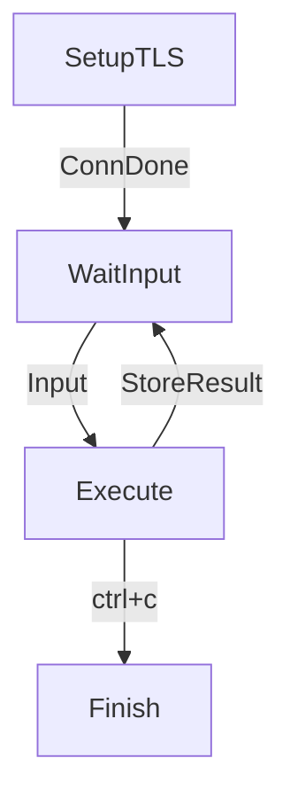

# How to deploy

## Pull our program and install dependencies

First, we need to enter our target folder, and pull the project to it using the commands followed. Enter the MPC_ECDSA folder before we continue.

```Shell
$ git clone https://github.com/antalpha-com/MPC_ECDSA.git
$ cd MPC_ECDSA
```

In the root directory, we use `go.mod` to install the dependencies.

```Shell
$ go mod tidy
```

## Modify cgo precompile directives

Next, we need to adjust `/pkg/gmp/int.go` according to our operating system. This project uses cgo to support the call to the gmp large number operation library. The CGO that comes with Golang can support interoperability with the C language interface. First, we need to modify the lines 13 to 23 under the `int.go` file according to the operating system the project is deployed.

**windows**

Under the Windows operating system, the remaining cgo pre-compile instructions should be the following two lines. Please keep them and comment (or delete) other #cgo lines.

```Shell
// windows
#cgo CFLAGS: -Iclib/win/include
#cgo LDFLAGS: -Lclib/win/lib -lgmp
```

**macOS**

Under the MacOS operating system, the remaining cgo pre-compile instructions should be the following two lines. Please keep them and comment (or delete) other #cgo lines.

```Shell
// macOS
//#cgo CFLAGS: -Iclib/mac/include
//#cgo LDFLAGS: -Lclib/mac/lib -lgmp
```

**linux**

Under the MacOS operating system, the remaining cgo pre-compile instructions should be the following two lines. Please keep them and comment (or delete) other #cgo lines.

```Shell
// linux
//#cgo CFLAGS: -Iclib/linux/include
//#cgo LDFLAGS: -Lclib/linux/lib -lgmp
```

## Generate certificate files

Establishing a TLS connection requires openssl to generate certificate related files. The script `getCert.sh` is given in the root directory, responsible for generating certificate related files

```Shell
$ sh getCert.sh
```

After that, we can see certificate files under `communication/config/`.

## Customize config file

The configuration files for this project are located in the "config" folder at the root of the project. These files should be customized by users based on their specific deployment scenarios. To facilitate user convenience, we have designed different configuration files for various stages of the protocol. Users can enable the appropriate configuration file when executing different stages.

#### Connection Establishment Configuration

connConfig.json is the configuration file for establishing secure connections when multiple parties initiate the process. The following provides an overview of each item in this configuration file:

| Index | Item             | Type                                                         | Introduction                                                 |
| ----- | ---------------- | ------------------------------------------------------------ | ------------------------------------------------------------ |
| 1     | localID          | string                                                       | id of this party                                             |
| 2     | localAddr        | string                                                       | Ip: port of this party                                       |
| 3     | totalPartyCount  | int                                                          | Total number of parties                                      |
| 4     | partyIDs         | []string                                                     | Ids of all parties                                           |
| 5     | otherPartyIDs    | []string                                                     | Other parties' ids except for this party                     |
| 6     | localCanBeServer | bool                                                         | Whether this party can be a server                           |
| 7     | otherPartyInfo   | An array of structure. Any element has 3 fields: id: stringaddr: stringconnRole:string | Information on connections with other partiesid：id of other partiesaddr：ip:port of other party (Required only if this party's connRole is server)connRole：connections role（server/client） |
| 8     | caPath           | string                                                       | Path of ca.crt file                                          |
| 9     | clientCertPath   | string                                                       | Path of client.crt file                                      |
| 10    | serverCertPath   | string                                                       | Path of server.crt file                                      |
| 11    | clientKeyPath    | string                                                       | Path of client.key file                                      |
| 12    | serverKeyPath    | string                                                       | Path of server.key file                                      |
| 13    | timeOutSecond    | int                                                          | The duration TLS connection becomes timeout                  |
| 14    | centerServerID   | string                                                       | id of the center party which is responsible for indicating stages to execute |

#### Key Generation Configuration

keygenConfig.json is the configuration file used by participants during the key generation process. The following provides an overview of each item in this configuration file:

| Index | Item        | Type | Introduction                                      |
| ----- | ----------- | ---- | ------------------------------------------------- |
| 1     | threshold   | int  | threshold                                         |
| 2     | useMnemonic | bool | Whether to generate keys using a mnemonic phrase. |

#### Key Refresh Configuration

refreshConfig.json is the configuration file used by participants during the key refresh process. The following provides an overview of each item in this configuration file:

| Index | Item           | Type     | Introduction                           |
| ----- | -------------- | -------- | -------------------------------------- |
| 1     | oldPartyCount  | int      | The total number of old parties        |
| 2     | oldPartyIDs    | []string | IDs of old parties                     |
| 3     | newPartyCount  | int      | The total number of new parties        |
| 4     | newPartyIDs    | string   | IDs of new parties                     |
| 5     | newThreshold   | int      | new Threshold                          |
| 6     | isOldCommittee | bool     | Whether the local party is a new party |
| 7     | isNewCommittee | bool     | Whether the local party is a old party |

#### Signature Configuration

signConfig.json is the configuration file used by participants during the signing process. The following provides an overview of each item in this configuration file:

| Index | Item          | Type     | Introduction                        |
| ----- | ------------- | -------- | ----------------------------------- |
| 1     | signers       | []string | signers                             |
| 2     | messageToSign | string   | The message that needs to be signed |

Once the above configuration files are prepared for all participants, you are ready to run the project.

## Run project

The `main.go` file shows how to coordinate each party execute each stage of ECDSA protocol after establishing a connection according to the configuration. The instructions for each participant to run main.go are as follows:

```Shell
$ go run main.go
```

We can see terminal of the center party prompting us to input stage to be executed. Different parties interact with each other according to the stage name entered by the user.

# Local test

## Multi-party test

This section introduces how to deploy our project with three participants for MPC ECDSA signature. The scenario is as follows:

- Party a: Initiate the execution of ECDSA protocal stage, and act as client in connections with b and c party
- Party b: Act as server in connection with b, and act as client in connection with c
- Party c: Act as client in connections with b and c party
- Message to sign："hello, world!"

If we use IDE to test, please open 3 windows to use the above steps to pull the project and modify the cgo instructions and generate the certificate file respectively

If using the command line, please open three terminals, and create three folders and use the above steps to pull the project and modify the cgo instructions and generate the certificate file.

**Configuration Settings for party a:**

1. Connection Establishment Configuration (connConfig.json):

```JSON
{
  "localID" : "a",
  "localAddr" : "localhost:8000",
  "totalPartyCount" : 3,
  "partyIDs": ["a", "b", "c"],
  "otherPartyIDs": ["b", "c"],
  "localCanBeServer": false,
  "otherPartyInfo":[
    {
      "id": "b",
      "addr": "localhost:8001",
      "connRole": "server"
    },
    {
      "id": "c",
      "addr": "localhost:8002",
      "connRole": "server"
    }
  ],
  "caPath": "./communication/config/ca.crt",
  "clientCertPath" : "./communication/config/client.crt",
  "serverCertPath": "./communication/config/server.crt",
  "clientKeyPath" : "./communication/config/client.key",
  "serverKeyPath" : "./communication/config/server.key",
  "timeOutSecond": 6000,
  "centerServerID": "a"
}
```

2.Key Generation Configuration (keygenConfig.json):

```JSON
{
  "threshold": 2,
  "useMnemonic": true
}
```

3.Signature Configuration (signConfig.json):

```JSON
{
  "signers": ["a", "b", "c"],
  "messageToSign": "hello, world!"
}
```

**Configuration Settings for party b:**

1. Connection Establishment Configuration (connConfig.json):

```JSON
{
  "localID" : "b",
  "localAddr" : "localhost:8001",
  "totalPartyCount" : 3,
  "partyIDs": ["a", "b", "c"],
  "otherPartyIDs": ["a", "c"],
  "localCanBeServer": true,
  "otherPartyInfo":[
    {
      "id": "a",
      "connRole": "client"
    },
    {
      "id": "c",
      "addr": "localhost:8002",
      "connRole": "server"
    }
  ],
  "caPath": "./communication/config/ca.crt",
  "clientCertPath" : "./communication/config/client.crt",
  "serverCertPath": "./communication/config/server.crt",
  "clientKeyPath" : "./communication/config/client.key",
  "serverKeyPath" : "./communication/config/server.key",
  "timeOutSecond": 6000,
  "centerServerID": "a"
}
```

2.Key Generation Configuration (keygenConfig.json):

```JSON
{
  "threshold": 2,
  "useMnemonic": true
}
```

3.Signature Configuration (signConfig.json):

```JSON
{
  "signers": ["a", "b", "c"],
  "messageToSign": "hello, world!"
}
```

**Configuration Settings for party c:**

1. Connection Establishment Configuration (connConfig.json):

```JSON
{
  "localID" : "c",
  "localAddr" : "localhost:8002",
  "totalPartyCount" : 3,
  "partyIDs": ["a", "b", "c"],
  "otherPartyIDs": ["a", "b"],
  "localCanBeServer": true,
  "otherPartyInfo":[
    {
      "id": "b",
      "connRole": "client"
    },
    {
      "id": "a",
      "connRole": "client"
    }
  ],
  "caPath": "./communication/config/ca.crt",
  "clientCertPath" : "./communication/config/client.crt",
  "serverCertPath": "./communication/config/server.crt",
  "clientKeyPath" : "./communication/config/client.key",
  "serverKeyPath" : "./communication/config/server.key",
  "timeOutSecond": 6000,
  "centerServerID": "a"
}
```

2.Key Generation Configuration (keygenConfig.json):

```JSON
{
  "threshold": 2,
  "useMnemonic": true
}
```

3.Signature Configuration (signConfig.json):

```JSON
{
  "signers": ["a", "b", "c"],
  "messageToSign": "hello, world!"
}
```

Run main.go for all parties. After the TLS connections are established, enter the stage name at the terminal of the center party to organize three participants for key generation, refresh, pre-signing and signing.


## (t, n) Key Refresh Testing

This section describes how to perform a key refresh test with a change in (t, n). We will deploy a scenario where 3 participants redistribute the key generation results to 4 new participants. The scenario is as follows:

- Participants a, b, c are old participants who have completed the key generation phase and have stored the key generation results locally.
- Participants e, f, g, h are new participants and do not have key information.

The old participants (a, b, c) need to redistribute the key generation results to the new participants (e, f, g, h) while keeping the overall secret unchanged. During this process, (t, n) changes from (2, 3) to (3, 4).

In the context of multi-party testing, participants a, b, c can perform key generation and save it locally. To conduct the key refresh test, all participants (both old and new) need to establish connections, read the key refresh configuration files, and follow the connection rules outlined in the multi-party testing process. Unlike the initial connection setup between a, b, c in the multi-party testing, here, it is necessary for a, b, c, d, e, f, g to establish connections so that old participants a, b, c can distribute the secret to new participants d, e, f, g.

**Key Refresh Configuration of party a:**

Configuration file for establishing connections between old and new parties: connConfigReshare.json

```JSON
{
  "localID" : "c",
  "localAddr" : "localhost:8002",
  "totalPartyCount" : 7,

  "partyIDs": ["a", "b", "c","d","e","f","g"],
  "otherPartyIDs": ["a", "b","d","e","f","g"],
  "localCanBeServer": true,
  "otherPartyInfo":[
    {
      "id": "b",
      "connRole": "client"
    },
    {
      "id": "a",
      "connRole": "client"
    },

    {
      "id": "d",
      "addr": "localhost:8003",
      "connRole": "server"
    }, {
      "id": "e",
      "addr": "localhost:8004",
      "connRole": "server"
    } , {
      "id": "f",
      "addr": "localhost:8005",
      "connRole": "server"
    }, {
      "id": "g",
      "addr": "localhost:8006",
      "connRole": "server"
    } ],
  "caPath": "./communication/config/ca.crt",
  "clientCertPath" : "./communication/config/client.crt",
  "serverCertPath": "./communication/config/server.crt",
  "clientKeyPath" : "./communication/config/client.key",
  "serverKeyPath" : "./communication/config/server.key",
  "timeOutSecond": 6000,
  "centerServerID": "a"
}
```

Key Refresh Configuration File: refreshConfig.json

```JSON
{
  "oldPartyCount" : 3,
  "oldPartyIDs": ["a", "b", "c"],

  "newPartyCount" : 4,
  "newPartyIDs": ["d", "e", "f", "g"],

  "newThreshold": 3,
  "isOldCommittee": true,
  "isNewCommittee": false
}
```

**Key Reshare Configuration of party b**

Configuration file for establishing connections between old and new parties: connConfigReshare.json

```JSON
{
  "localID" : "b",
  "localAddr" : "localhost:8001",
  "totalPartyCount" : 7,

  "partyIDs": ["a", "b", "c","d","e","f","g"],
  "otherPartyIDs": ["a", "c","d","e","f","g"],
  "localCanBeServer": true,
  "otherPartyInfo":[
    {
      "id": "a",
      "connRole": "client"
    },
    {
      "id": "c",
      "addr": "localhost:8002",
      "connRole": "server"
    },

    {
      "id": "d",
      "addr": "localhost:8003",
      "connRole": "server"
    }, {
      "id": "e",
      "addr": "localhost:8004",
      "connRole": "server"
    } , {
      "id": "f",
      "addr": "localhost:8005",
      "connRole": "server"
    }, {
      "id": "g",
      "addr": "localhost:8006",
      "connRole": "server"
    } ],
  "caPath": "./communication/config/ca.crt",
  "clientCertPath" : "./communication/config/client.crt",
  "serverCertPath": "./communication/config/server.crt",
  "clientKeyPath" : "./communication/config/client.key",
  "serverKeyPath" : "./communication/config/server.key",
  "timeOutSecond": 6000,
  "centerServerID": "a"
}
```

Key Refresh Configuration File: refreshConfig.json

```JSON
{
  "oldPartyCount" : 3,
  "oldPartyIDs": ["a", "b", "c"],

  "newPartyCount" : 4,
  "newPartyIDs": ["d", "e", "f", "g"],

  "newThreshold": 3,
  "isOldCommittee": true,
  "isNewCommittee": false
}
```

**Key Reshare Configuration of party c**

Configuration file for establishing connections between old and new parties: connConfigReshare.json

```JSON
{
  "localID" : "c",
  "localAddr" : "localhost:8002",
  "totalPartyCount" : 7,

  "partyIDs": ["a", "b", "c","d","e","f","g"],
  "otherPartyIDs": ["a", "b","d","e","f","g"],
  "localCanBeServer": true,
  "otherPartyInfo":[
    {
      "id": "b",
      "connRole": "client"
    },
    {
      "id": "a",
      "connRole": "client"
    },

    {
      "id": "d",
      "addr": "localhost:8003",
      "connRole": "server"
    }, {
      "id": "e",
      "addr": "localhost:8004",
      "connRole": "server"
    } , {
      "id": "f",
      "addr": "localhost:8005",
      "connRole": "server"
    }, {
      "id": "g",
      "addr": "localhost:8006",
      "connRole": "server"
    } ],
  "caPath": "./communication/config/ca.crt",
  "clientCertPath" : "./communication/config/client.crt",
  "serverCertPath": "./communication/config/server.crt",
  "clientKeyPath" : "./communication/config/client.key",
  "serverKeyPath" : "./communication/config/server.key",
  "timeOutSecond": 6000,
  "centerServerID": "a"
}
```

Key Refresh Configuration File: refreshConfig.json

```JSON
{
  "oldPartyCount" : 3,
  "oldPartyIDs": ["a", "b", "c"],

  "newPartyCount" : 4,
  "newPartyIDs": ["d", "e", "f", "g"],

  "newThreshold": 3,
  "isOldCommittee": true,
  "isNewCommittee": false
}
```

**Key Reshare Configuration of party d**

Configuration file for establishing connections between old and new parties: connConfigReshare.json

```JSON
{
  "localID" : "d",
  "localAddr" : "localhost:8003",
  "totalPartyCount" : 7,

  "partyIDs": ["a", "b", "c","d","e","f","g"],
  "otherPartyIDs": ["b", "c","a","e","f","g"],
  "localCanBeServer": true,
  "otherPartyInfo":[
    {
      "id": "b",
      "connRole": "client"
    },
    {
      "id": "c",
      "connRole": "client"
    },

    {
      "id": "a",
      "connRole": "client"
    }, {
      "id": "e",
      "addr": "localhost:8004",
      "connRole": "server"
    } , {
      "id": "f",
      "addr": "localhost:8005",
      "connRole": "server"
    }, {
      "id": "g",
      "addr": "localhost:8006",
      "connRole": "server"
    } ],
  "caPath": "./communication/config/ca.crt",
  "clientCertPath" : "./communication/config/client.crt",
  "serverCertPath": "./communication/config/server.crt",
  "clientKeyPath" : "./communication/config/client.key",
  "serverKeyPath" : "./communication/config/server.key",
  "timeOutSecond": 6000,
  "centerServerID": "a"
}
```

Key Refresh Configuration File: refreshConfig.json

```JSON
{
  "oldPartyCount" : 3,
  "oldPartyIDs": ["a", "b", "c"],

  "newPartyCount" : 4,
  "newPartyIDs": ["d", "e", "f", "g"],

  "newThreshold": 3,
  "isOldCommittee": false,
  "isNewCommittee": true
}
```

**Key Reshare Configuration of party e**

Configuration file for establishing connections between old and new parties: connConfigReshare.json

```JSON
{
  "localID" : "e",
  "localAddr" : "localhost:8004",
  "totalPartyCount" : 7,

  "partyIDs": ["a", "b", "c","d","e","f","g"],
  "otherPartyIDs": ["b", "c","d","a","f","g"],
  "localCanBeServer": true,
  "otherPartyInfo":[
    {
      "id": "b",
      "connRole": "client"
    },
    {
      "id": "c",
      "connRole": "client"
    },

    {
      "id": "d",
      "connRole": "client"
    }, {
      "id": "a",
      "connRole": "client"
    } , {
      "id": "f",
      "addr": "localhost:8005",
      "connRole": "server"
    }, {
      "id": "g",
      "addr": "localhost:8006",
      "connRole": "server"
    } ],
  "caPath": "./communication/config/ca.crt",
  "clientCertPath" : "./communication/config/client.crt",
  "serverCertPath": "./communication/config/server.crt",
  "clientKeyPath" : "./communication/config/client.key",
  "serverKeyPath" : "./communication/config/server.key",
  "timeOutSecond": 6000,
  "centerServerID": "a"
}
```

Key Refresh Configuration File: refreshConfig.json

```JSON
{
  "oldPartyCount" : 3,
  "oldPartyIDs": ["a", "b", "c"],

  "newPartyCount" : 4,
  "newPartyIDs": ["d", "e", "f", "g"],

  "newThreshold": 3,
  "isOldCommittee":false,
  "isNewCommittee": true
}
```

**Key Reshare Configuration of party f**

Configuration file for establishing connections between old and new parties: connConfigReshare.json

```JSON
{
  "localID" : "f",
  "localAddr" : "localhost:8005",
  "totalPartyCount" : 7,

  "partyIDs": ["a", "b", "c","d","e","f","g"],
  "otherPartyIDs": ["b", "c","d","e","a","g"],
  "localCanBeServer": true,
  "otherPartyInfo":[
    {
      "id": "b",
      "connRole": "client"
    },
    {
      "id": "c",
      "connRole": "client"
    },

    {
      "id": "d",
      "connRole": "client"
    }, {
      "id": "e",
      "connRole": "client"
    } , {
      "id": "a",
      "connRole": "client"
    }, {
      "id": "g",
      "addr": "localhost:8006",
      "connRole": "server"
    } ],
  "caPath": "./communication/config/ca.crt",
  "clientCertPath" : "./communication/config/client.crt",
  "serverCertPath": "./communication/config/server.crt",
  "clientKeyPath" : "./communication/config/client.key",
  "serverKeyPath" : "./communication/config/server.key",
  "timeOutSecond": 6000,
  "centerServerID": "a"
}
```

Key Refresh Configuration File: refreshConfig.json

```JSON
{
  "oldPartyCount" : 3,
  "oldPartyIDs": ["a", "b", "c"],

  "newPartyCount" : 4,
  "newPartyIDs": ["d", "e", "f", "g"],

  "newThreshold": 3,
  "isOldCommittee": false,
  "isNewCommittee": true
}
```

**Key Reshare Configuration of party g**

Configuration file for establishing connections between old and new parties: connConfigReshare.json

```JSON
{
  "localID" : "g",
  "localAddr" : "localhost:8006",
  "totalPartyCount" : 7,

  "partyIDs": ["a", "b", "c","d","e","f","g"],
  "otherPartyIDs": ["b", "c","d","e","a","f"],
  "localCanBeServer": true,
  "otherPartyInfo":[
    {
      "id": "b",
      "connRole": "client"
    },
    {
      "id": "c",
      "connRole": "client"
    },

    {
      "id": "d",
      "connRole": "client"
    }, {
      "id": "e",
      "connRole": "client"
    } , {
      "id": "a",
      "connRole": "client"
    }, {
      "id": "f",
      "connRole": "client"
    } ],
  "caPath": "./communication/config/ca.crt",
  "clientCertPath" : "./communication/config/client.crt",
  "serverCertPath": "./communication/config/server.crt",
  "clientKeyPath" : "./communication/config/client.key",
  "serverKeyPath" : "./communication/config/server.key",
  "timeOutSecond": 6000,
  "centerServerID": "a"
}
```

Key Refresh Configuration File: refreshConfig.json

```JSON
{
  "oldPartyCount" : 3,
  "oldPartyIDs": ["a", "b", "c"],

  "newPartyCount" : 4,
  "newPartyIDs": ["d", "e", "f", "g"],

  "newThreshold": 3,
  "isOldCommittee": false,
  "isNewCommittee": true
}
```

All participants should run `main.go`. After the connections are established, in the terminal of party a,  you can enter the key refresh command (Reshare) to initiate the key refresh process. This will organize the three old parties (a,b,c) to perform key refresh for the four new parties (d,e,f,g). Finally, the new participants (d,e,f,g) will receive the updated key results and store them locally, while the key generation results of the old parties will be cleared.

## Unit Test

Many Unit Test files are provided in most packages of this project to help developers with testing. This section introduces ideas of each test file under the `protocols` package

**keyGen_test.go**

This file is used to test whether the key generation stage and key refresh stage are running well and check the results generated . Use the following instructions to execute the test (or use the IDE to run the test function).

```Shell
$ go test -v ./protocols/keygen/keyGen_test.go
```

**abort_test.go**

This file is used to check whether the protocol can enter abort stage to identify malicious as expected when different errors occur in the pre-signature stage. Use the following instructions to execute the test (or use the IDE to run the test function)

```Shell
$ go test -v ./protocols/presign/abort_test.go
```

**presign_sign_test.go**

This file is used to test whether the pre-signature stage and signature stage using pre-signature results are running well and check the results generated .Use the following instructions to execute the test (or use the IDE to run the test function)

```Shell
$ go test -v ./protocols/presign/presign_sign_test.go
```

**sign_test.go**

This file is used to test whether the sign stage is running well and check the results generated .Use the following instructions to execute the test (or use the IDE to run the test function)

```Shell
$ go test -v ./protocols/sign/sign_test.go
```

**all_stage_test.go**

This file tests the running process and checks the generated results in the order of key generation, key refresh, generation pre-signature, and signature. Use the following instructions to execute the test:

```Shell
$ go test -v ./protocols/all_stage_test.go
```

# How to customize scheduling

If we want to adjust the logic of executing protocol, the following introduction may be helpful:

## How to add a config item

First, determine the expected type and name of our configuration item. After adding the configuration item in the configuration file `config.json`, we need to add the corresponding item to the `LocalConfig` structure of `communication/communicate.go` file, and indicate the name of json

e.g.: If we want to add a `version` config, add the key-value to `config.json`

```JSON
"version": 1
```

Edit `communication/communicate.go`, midify `LocalConfig`

```Go
// LocalConfig struct represents the local configuration for the application.
type LocalConfig struct {
    ...
    Version int `json:"version"`
}
```

And then, we can process the config structure after unmarshal.

## How to modify the main logic

The current `main.go` file organizes the participants to run the various stages of the protocol according to the logic of [establish TLS connection - enter stage name  in the center party terminal - execute the stage- continue to wait for input]




If you need to modify such logic, you can rewrite the `main.go` file.

**Set up connections**

`communication. SetUpConn()` is called when a connection needs to be established, the configuration items, as well as the TLS connection, and the intermediate results generated by the stage run will be saved in the `localConn` variable.

```Go
//Establish a network connection with other participants.
//The returned value localConn represents the local connection to the network.
localConn := communication.SetUpConn()
```

If localConn is in need, remember to pass it into the function as a parameter passed by reference. For example:

```Go
func PreSign(localConn *communication.LocalConn, n *test.Network, pl *pool.Pool)
```

**Execute a stage**

If we need to execute a stage in a file, we can refer to the example in `main.go`. What we need to do is create a `MultiHandler`, pass the starting function of the stage into `NewMultiHandler`, and use `Result ()` to get the final execution result

```Go
//Create a new MultiHandler for the Presign protocol
h, err := protocol.NewMultiHandler(protocols.Presign(config, signers, pl), nil, *localConn) //handler表示一个协议的执行
if err != nil {
log.Errorln(err)
return err
}
// Get the result of the protocol execution
preSignResult, err := h.Result()
```