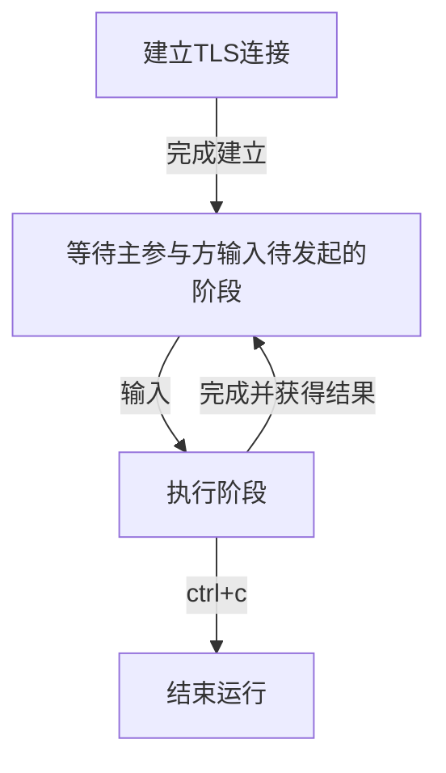

# 部署方式

## 拉取项目并安装依赖

首先进入到目标文件夹，将本项目拉取到本地，并进入MPC_ECDSA文件夹下

```Shell
$ git clone https://github.com/antalpha-com/MPC_ECDSA.git
$ cd MPC_ECDSA
```

在根目录下使用`go.mod`文件安装项目依赖项

```Shell
$ go mod tidy
```

## 修改cgo预编译指令

接下来我们需要根据部署的操作系统来对`/pkg/gmp/int.go`来做调整。本项目用了cgo来支持对gmp大数运算库的调用，Golang 自带的 CGO 可以支持与 C 语言接口的互通。首先需要用部署的操作系统下修改`int.go`文件下的13~23行部分。

**windows**

windows操作系统下，留下的cgo预编译指令应当是下面两行

```Shell
// windows
#cgo CFLAGS: -Iclib/win/include
#cgo LDFLAGS: -Lclib/win/lib -lgmp
```

**macOS**

macOS操作系统下，留下的cgo预编译指令应当是下面两行

```Shell
// macOS
//#cgo CFLAGS: -Iclib/mac/include
//#cgo LDFLAGS: -Lclib/mac/lib -lgmp
```

**linux**

linux操作系统下，留下的cgo预编译指令应当是下面两行

```Shell
// linux
//#cgo CFLAGS: -Iclib/linux/include
//#cgo LDFLAGS: -Lclib/linux/lib -lgmp
```

## 生成证书文件

建立TLS连接需要使用openssl生成证书相关文件。根目录下给出了脚本`getCert.sh`，负责生成证书相关的文件

```Shell
$ sh getCert.sh
```

经过这一步，在`communication/config/`目录下就会生成我们需要的证书文件

## 自定义配置文件

本项目的配置文件是位于项目根目录下的config文件夹中，这类文件需要用户根据部署的真实情况来进行设置。为方便用户的使用，我们为协议的不同阶段设计了不同的配置文件，用户在执行不同阶段时启用相应的配置文件即可。

#### 建立连接的配置文件

connConfig.json是多方启动时建立安全连接的配置文件。接下来对该配置文件的每一项进行介绍：

| 序号 | 名称             | 类型                                                         | 介绍                                                         |
| ---- | ---------------- | ------------------------------------------------------------ | ------------------------------------------------------------ |
| 1    | localID          | string                                                       | 本参与方的id                                                 |
| 2    | localAddr        | string                                                       | 本参与方的ip:端口号                                          |
| 3    | totalPartyCount  | int                                                          | 参与方的总数目                                               |
| 4    | partyIDs         | []string                                                     | 所有参与方的id                                               |
| 5    | otherPartyIDs    | []string                                                     | 除去本参与方，其他参与方的id                                 |
| 6    | localCanBeServer | bool                                                         | 本参与方能否成为server                                       |
| 7    | otherPartyInfo   | 结构体数组，每个单元内部含有三个字段id: stringaddr: stringconnRole:string | 与其他参与方的连接信息id：其他参与方的idaddr：其他参与方的ip:端口号（仅当此参与方connRole为server时必填）connRole：连接时的角色（server/client） |
| 8    | caPath           | string                                                       | ca.crt文件路径                                               |
| 9    | clientCertPath   | string                                                       | client.crt文件路径                                           |
| 10   | serverCertPath   | string                                                       | server.crt文件路径                                           |
| 11   | clientKeyPath    | string                                                       | client.key文件路径                                           |
| 12   | serverKeyPath    | string                                                       | server.key文件路径                                           |
| 13   | timeOutSecond    | int                                                          | TLS连接的超时时间                                            |
| 14   | centerServerID   | string                                                       | 中心参与方（负责发起协议执行的参与方）的id                   |

#### 密钥生成的配置文件

keygenConfig.json是参与方进行密钥生成时使用的配置文件。接下来对该配置文件的每一项进行介绍：

| 序号 | 名称        | 类型 | 介绍                   |
| ---- | ----------- | ---- | ---------------------- |
| 1    | threshold   | int  | 门限值                 |
| 2    | useMnemonic | bool | 是否使用助记词生成密钥 |

#### 密钥刷新的配置文件

refreshConfig.json是参与方进行密钥刷新时使用的配置文件。接下来对该配置文件的每一项进行介绍：

| 序号 | 名称           | 类型     | 介绍           |
| ---- | -------------- | -------- | -------------- |
| 1    | oldPartyCount  | int      | 旧参与方的总数 |
| 2    | oldPartyIDs    | []string | 旧参与方的ID   |
| 3    | newPartyCount  | int      | 新参与方的总数 |
| 4    | newPartyIDs    | string   | 新参与方的ID   |
| 5    | newThreshold   | int      | 新门限         |
| 6    | isOldCommittee | bool     | 是否为新参与方 |
| 7    | isNewCommittee | bool     | 是否为旧参与方 |

#### 签名的配置文件

signConfig.json是参与方进行签名时使用的配置文件。接下来对该配置文件的每一项进行介绍：

| 序号 | 名称          | 类型     | 介绍               |
| ---- | ------------- | -------- | ------------------ |
| 1    | signers       | []string | 参与签名的参与方id |
| 2    | messageToSign | string   | 需要被签名的消息   |


当为所有参与方编写好以上配置文件后，即可准备运行项目。

## 运行

main.go文件示例了根据配置建立连接后的各个参与方，根据主参与方的协调，运行用户输入的各个协议阶段的程序。各参与方运行main.go的指令如下：

```Shell
$ go run main.go
```

用户在主参与方终端可以看到，建立连接完成后，提示输入发起的阶段，不同参与方根据用户输入的阶段名称进行交互运行协议。

# 本地测试

## 多参与方测试

本小节介绍如何部署一个三个参与方进行多方签名的项目，场景如下：

- 参与方a：作为主参与方负责发起协议，和b,c的连接中都作为client
- 参与方b：和a的连接作为server，和c的连接作为client
- 参与方c：和a,b的连接中都作为server
- 签名消息："hello, world!"

如果使用IDE进行测试，请打开三个窗口分别使用上面的步骤拉取项目并修改cgo指令以及生成证书文件

如果使用命令行请打开三个终端，建立三个文件夹并分别使用上面的步骤拉取项目并修改cgo指令以及生成证书文件

**对参与方a的各配置文件进行如下设置**：

1.建立连接的配置文件connConfig.json:

```JSON
{
  "localID" : "a",
  "localAddr" : "localhost:8000",
  "totalPartyCount" : 3,
  "partyIDs": ["a", "b", "c"],
  "otherPartyIDs": ["b", "c"],
  "localCanBeServer": false,
  "otherPartyInfo":[
    {
      "id": "b",
      "addr": "localhost:8001",
      "connRole": "server"
    },
    {
      "id": "c",
      "addr": "localhost:8002",
      "connRole": "server"
    }
  ],
  "caPath": "./communication/config/ca.crt",
  "clientCertPath" : "./communication/config/client.crt",
  "serverCertPath": "./communication/config/server.crt",
  "clientKeyPath" : "./communication/config/client.key",
  "serverKeyPath" : "./communication/config/server.key",
  "timeOutSecond": 6000,
  "centerServerID": "a"
}
```

2.进行密钥生成的配置文件keygenConfig.json

```JSON
{
  "threshold": 2,
  "useMnemonic": true
}
```

3.进行签名的配置文件SignConfig.json

```JSON
{
  "signers": ["a", "b", "c"],
  "messageToSign": "hello, world!"
}
```


**对参与方b的各配置文件进行如下设置**：

1.建立连接的配置文件connConfig.json:

```JSON
{
  "localID" : "b",
  "localAddr" : "localhost:8001",
  "totalPartyCount" : 3,
  "partyIDs": ["a", "b", "c"],
  "otherPartyIDs": ["a", "c"],
  "localCanBeServer": true,
  "otherPartyInfo":[
    {
      "id": "a",
      "connRole": "client"
    },
    {
      "id": "c",
      "addr": "localhost:8002",
      "connRole": "server"
    }
  ],
  "caPath": "./communication/config/ca.crt",
  "clientCertPath" : "./communication/config/client.crt",
  "serverCertPath": "./communication/config/server.crt",
  "clientKeyPath" : "./communication/config/client.key",
  "serverKeyPath" : "./communication/config/server.key",
  "timeOutSecond": 6000,
  "centerServerID": "a"
}
```

2.进行密钥生成的配置文件keygenConfig.json

```JSON
{
  "threshold": 2,
  "useMnemonic": true
}
```

3.进行签名的配置文件SignConfig.json

```JSON
{
  "signers": ["a", "b", "c"],
  "messageToSign": "hello, world!"
}
```

**对参与方c的各配置文件进行如下设置**：

1.建立连接的配置文件connConfig.json:

```JSON
{
  "localID" : "c",
  "localAddr" : "localhost:8002",
  "totalPartyCount" : 3,
  "partyIDs": ["a", "b", "c"],
  "otherPartyIDs": ["a", "b"],
  "localCanBeServer": true,
  "otherPartyInfo":[
    {
      "id": "b",
      "connRole": "client"
    },
    {
      "id": "a",
      "connRole": "client"
    }
  ],
  "caPath": "./communication/config/ca.crt",
  "clientCertPath" : "./communication/config/client.crt",
  "serverCertPath": "./communication/config/server.crt",
  "clientKeyPath" : "./communication/config/client.key",
  "serverKeyPath" : "./communication/config/server.key",
  "timeOutSecond": 6000,
  "centerServerID": "a"
}
```

2.进行密钥生成的配置文件keygenConfig.json

```JSON
{
  "threshold": 2,
  "useMnemonic": true
}
```

3.进行签名的配置文件SignConfig.json

```JSON
{
  "signers": ["a", "b", "c"],
  "messageToSign": "hello, world!"
}
```

多参与方都运行`main.go`，等连接建立完成后，在a参与方的终端输入发起的阶段名称即可组织三个参与方进行密钥生成、刷新、预签名和签名。

## （t,n）密钥刷新测试

本小节介绍如何在改变（t,n）的情况下进行密钥刷新测试。部署一个由3个参与方将密钥生成结果重新分发给4个参与方的测例。场景如下：

- 参与方a、b、c是旧参与方，他们已经完成密钥生成阶段，并将密钥生成结果存储在本地。

- 参与方e,f,g,h是新的参与方，没有密钥信息。

  旧参与方们(a,b,c)需要将密钥生成结果重新分发给新参与方们(e,f,g,h)，保持总秘密不变。这个过程中(t,n)由（2,3）变为(3,4)。


在多参与方测试的过程中，参与方a,b,c可以执行密钥生成并且保存到本地。下面进行密钥刷新测试时需要将全部参与方（新参与方和旧参与方）重新建立连接，并读取密钥刷新的配置文件。

这里建立连接的要求与多参与方测试的过程中的建立连接规则一致，不同的是，这里不再是a,b,c建立连接，而是需要a,b,c,d,e,f,g建立连接才能由旧参与方a,b,c将秘密分发给新参与方d,e,f,g.

**参与方a的密钥刷新配置文件如下**：

新旧参与方建立连接的配置文件connConfigReshare.json:

```JSON
{
  "localID" : "c",
  "localAddr" : "localhost:8002",
  "totalPartyCount" : 7,

  "partyIDs": ["a", "b", "c","d","e","f","g"],
  "otherPartyIDs": ["a", "b","d","e","f","g"],
  "localCanBeServer": true,
  "otherPartyInfo":[
    {
      "id": "b",
      "connRole": "client"
    },
    {
      "id": "a",
      "connRole": "client"
    },

    {
      "id": "d",
      "addr": "localhost:8003",
      "connRole": "server"
    }, {
      "id": "e",
      "addr": "localhost:8004",
      "connRole": "server"
    } , {
      "id": "f",
      "addr": "localhost:8005",
      "connRole": "server"
    }, {
      "id": "g",
      "addr": "localhost:8006",
      "connRole": "server"
    } ],
  "caPath": "./communication/config/ca.crt",
  "clientCertPath" : "./communication/config/client.crt",
  "serverCertPath": "./communication/config/server.crt",
  "clientKeyPath" : "./communication/config/client.key",
  "serverKeyPath" : "./communication/config/server.key",
  "timeOutSecond": 6000,
  "centerServerID": "a"
}
```

密钥刷新的配置文件refreshConfig.json：

```JSON
{
  "oldPartyCount" : 3,
  "oldPartyIDs": ["a", "b", "c"],

  "newPartyCount" : 4,
  "newPartyIDs": ["d", "e", "f", "g"],

  "newThreshold": 3,
  "isOldCommittee": true,
  "isNewCommittee": false
}
```

**参与方b的密钥刷新配置文件如下**：

新旧参与方建立连接的配置文件connConfigReshare.json:

```JSON
{
  "localID" : "b",
  "localAddr" : "localhost:8001",
  "totalPartyCount" : 7,

  "partyIDs": ["a", "b", "c","d","e","f","g"],
  "otherPartyIDs": ["a", "c","d","e","f","g"],
  "localCanBeServer": true,
  "otherPartyInfo":[
    {
      "id": "a",
      "connRole": "client"
    },
    {
      "id": "c",
      "addr": "localhost:8002",
      "connRole": "server"
    },

    {
      "id": "d",
      "addr": "localhost:8003",
      "connRole": "server"
    }, {
      "id": "e",
      "addr": "localhost:8004",
      "connRole": "server"
    } , {
      "id": "f",
      "addr": "localhost:8005",
      "connRole": "server"
    }, {
      "id": "g",
      "addr": "localhost:8006",
      "connRole": "server"
    } ],
  "caPath": "./communication/config/ca.crt",
  "clientCertPath" : "./communication/config/client.crt",
  "serverCertPath": "./communication/config/server.crt",
  "clientKeyPath" : "./communication/config/client.key",
  "serverKeyPath" : "./communication/config/server.key",
  "timeOutSecond": 6000,
  "centerServerID": "a"
}
```

密钥刷新的配置文件refreshConfig.json：

```JSON
{
  "oldPartyCount" : 3,
  "oldPartyIDs": ["a", "b", "c"],

  "newPartyCount" : 4,
  "newPartyIDs": ["d", "e", "f", "g"],

  "newThreshold": 3,
  "isOldCommittee": true,
  "isNewCommittee": false
}
```

**参与方c的密钥刷新配置文件如下**：

新旧参与方建立连接的配置文件connConfigReshare.json:

```JSON
{
  "localID" : "c",
  "localAddr" : "localhost:8002",
  "totalPartyCount" : 7,

  "partyIDs": ["a", "b", "c","d","e","f","g"],
  "otherPartyIDs": ["a", "b","d","e","f","g"],
  "localCanBeServer": true,
  "otherPartyInfo":[
    {
      "id": "b",
      "connRole": "client"
    },
    {
      "id": "a",
      "connRole": "client"
    },

    {
      "id": "d",
      "addr": "localhost:8003",
      "connRole": "server"
    }, {
      "id": "e",
      "addr": "localhost:8004",
      "connRole": "server"
    } , {
      "id": "f",
      "addr": "localhost:8005",
      "connRole": "server"
    }, {
      "id": "g",
      "addr": "localhost:8006",
      "connRole": "server"
    } ],
  "caPath": "./communication/config/ca.crt",
  "clientCertPath" : "./communication/config/client.crt",
  "serverCertPath": "./communication/config/server.crt",
  "clientKeyPath" : "./communication/config/client.key",
  "serverKeyPath" : "./communication/config/server.key",
  "timeOutSecond": 6000,
  "centerServerID": "a"
}
```

密钥刷新配置文件refreshConfig.json：

```JSON
{
  "oldPartyCount" : 3,
  "oldPartyIDs": ["a", "b", "c"],

  "newPartyCount" : 4,
  "newPartyIDs": ["d", "e", "f", "g"],

  "newThreshold": 3,
  "isOldCommittee": true,
  "isNewCommittee": false
}
```

**参与方d的密钥刷新配置文件如下**：

新旧参与方建立连接的配置文件connConfigReshare.json:

```JSON
{
  "localID" : "d",
  "localAddr" : "localhost:8003",
  "totalPartyCount" : 7,

  "partyIDs": ["a", "b", "c","d","e","f","g"],
  "otherPartyIDs": ["b", "c","a","e","f","g"],
  "localCanBeServer": true,
  "otherPartyInfo":[
    {
      "id": "b",
      "connRole": "client"
    },
    {
      "id": "c",
      "connRole": "client"
    },

    {
      "id": "a",
      "connRole": "client"
    }, {
      "id": "e",
      "addr": "localhost:8004",
      "connRole": "server"
    } , {
      "id": "f",
      "addr": "localhost:8005",
      "connRole": "server"
    }, {
      "id": "g",
      "addr": "localhost:8006",
      "connRole": "server"
    } ],
  "caPath": "./communication/config/ca.crt",
  "clientCertPath" : "./communication/config/client.crt",
  "serverCertPath": "./communication/config/server.crt",
  "clientKeyPath" : "./communication/config/client.key",
  "serverKeyPath" : "./communication/config/server.key",
  "timeOutSecond": 6000,
  "centerServerID": "a"
}
```

密钥刷新配置文件refreshConfig.json：

```JSON
{
  "oldPartyCount" : 3,
  "oldPartyIDs": ["a", "b", "c"],

  "newPartyCount" : 4,
  "newPartyIDs": ["d", "e", "f", "g"],

  "newThreshold": 3,
  "isOldCommittee": false,
  "isNewCommittee": true
}
```

**参与方e的密钥刷新配置文件如下**：

新旧参与方建立连接的配置文件connConfigReshare.json:

```JSON
{
  "localID" : "e",
  "localAddr" : "localhost:8004",
  "totalPartyCount" : 7,

  "partyIDs": ["a", "b", "c","d","e","f","g"],
  "otherPartyIDs": ["b", "c","d","a","f","g"],
  "localCanBeServer": true,
  "otherPartyInfo":[
    {
      "id": "b",
      "connRole": "client"
    },
    {
      "id": "c",
      "connRole": "client"
    },

    {
      "id": "d",
      "connRole": "client"
    }, {
      "id": "a",
      "connRole": "client"
    } , {
      "id": "f",
      "addr": "localhost:8005",
      "connRole": "server"
    }, {
      "id": "g",
      "addr": "localhost:8006",
      "connRole": "server"
    } ],
  "caPath": "./communication/config/ca.crt",
  "clientCertPath" : "./communication/config/client.crt",
  "serverCertPath": "./communication/config/server.crt",
  "clientKeyPath" : "./communication/config/client.key",
  "serverKeyPath" : "./communication/config/server.key",
  "timeOutSecond": 6000,
  "centerServerID": "a"
}
```

密钥刷新配置文件refreshConfig.json：

```JSON
{
  "oldPartyCount" : 3,
  "oldPartyIDs": ["a", "b", "c"],

  "newPartyCount" : 4,
  "newPartyIDs": ["d", "e", "f", "g"],

  "newThreshold": 3,
  "isOldCommittee":false,
  "isNewCommittee": true
}
```

**参与方f的密钥刷新配置文件如下**：

新旧参与方建立连接的配置文件connConfigReshare.json:

```JSON
{
  "localID" : "f",
  "localAddr" : "localhost:8005",
  "totalPartyCount" : 7,

  "partyIDs": ["a", "b", "c","d","e","f","g"],
  "otherPartyIDs": ["b", "c","d","e","a","g"],
  "localCanBeServer": true,
  "otherPartyInfo":[
    {
      "id": "b",
      "connRole": "client"
    },
    {
      "id": "c",
      "connRole": "client"
    },

    {
      "id": "d",
      "connRole": "client"
    }, {
      "id": "e",
      "connRole": "client"
    } , {
      "id": "a",
      "connRole": "client"
    }, {
      "id": "g",
      "addr": "localhost:8006",
      "connRole": "server"
    } ],
  "caPath": "./communication/config/ca.crt",
  "clientCertPath" : "./communication/config/client.crt",
  "serverCertPath": "./communication/config/server.crt",
  "clientKeyPath" : "./communication/config/client.key",
  "serverKeyPath" : "./communication/config/server.key",
  "timeOutSecond": 6000,
  "centerServerID": "a"
}
```

密钥刷新配置文件refreshConfig.json：

```JSON
{
  "oldPartyCount" : 3,
  "oldPartyIDs": ["a", "b", "c"],

  "newPartyCount" : 4,
  "newPartyIDs": ["d", "e", "f", "g"],

  "newThreshold": 3,
  "isOldCommittee": false,
  "isNewCommittee": true
}
```

**参与方g的密钥刷新配置文件如下**：

新旧参与方建立连接的配置文件connConfigReshare.json:

```JSON
{
  "localID" : "g",
  "localAddr" : "localhost:8006",
  "totalPartyCount" : 7,

  "partyIDs": ["a", "b", "c","d","e","f","g"],
  "otherPartyIDs": ["b", "c","d","e","a","f"],
  "localCanBeServer": true,
  "otherPartyInfo":[
    {
      "id": "b",
      "connRole": "client"
    },
    {
      "id": "c",
      "connRole": "client"
    },

    {
      "id": "d",
      "connRole": "client"
    }, {
      "id": "e",
      "connRole": "client"
    } , {
      "id": "a",
      "connRole": "client"
    }, {
      "id": "f",
      "connRole": "client"
    } ],
  "caPath": "./communication/config/ca.crt",
  "clientCertPath" : "./communication/config/client.crt",
  "serverCertPath": "./communication/config/server.crt",
  "clientKeyPath" : "./communication/config/client.key",
  "serverKeyPath" : "./communication/config/server.key",
  "timeOutSecond": 6000,
  "centerServerID": "a"
}
```

密钥刷新配置文件refreshConfig.json：

```JSON
{
  "oldPartyCount" : 3,
  "oldPartyIDs": ["a", "b", "c"],

  "newPartyCount" : 4,
  "newPartyIDs": ["d", "e", "f", "g"],

  "newThreshold": 3,
  "isOldCommittee": false,
  "isNewCommittee": true
}
```

所有参与方都运行`main.go`，等连接建立完成后，在a参与方的终端输入密钥刷新指令（Reshare）即可组织三个旧参与方a,b,c对4个新参与方d,e,f,g进行密钥刷新。最后新参与方d,e,f,g将获得密钥更新的结果并保存到本地，而旧参与方的密钥生成结果将清空。


## 单元测试

本项目大部分包内都提供了许多单元测试文件，帮助开发人员进行测试。本节介绍`protocols`包下各个测试文件的测试方法

**keyGen_test.go**

本文件用于测试密钥生成阶段和密钥刷新阶段运行过程并检查生成的结果，使用下面指令执行测试（或使用IDE运行测试函数）

```Shell
$ go test -v ./protocols/keygen/keyGen_test.go
```

**abort_test.go**

本文件用于测试预签名阶段不同的错误出现时的运行过程并检查协议能否按照预期进入abort，使用下面指令执行测试（或使用IDE运行测试函数）

```Shell
$ go test -v ./protocols/presign/abort_test.go
```

**presign_sign_test.go**

本文件用于测试预签名阶段和使用预签名结果进行签名阶段运行过程并检查生成的结果，使用下面指令执行测试（或使用IDE运行测试函数）

```Shell
$ go test -v ./protocols/presign/presign_sign_test.go
```

**sign_test.go**

本文件用于测试直接进行签名阶段运行过程并检查生成的结果，使用下面指令执行测试（或使用IDE运行测试函数）

```Shell
$ go test -v ./protocols/sign/sign_test.go
```

**all_stage_test.go**

本文件用于测试密钥生成阶段密钥刷新阶段运行过程并检查生成的结果，使用下面指令执行测试：

```Shell
$ go test -v ./protocols/all_stage_test.go
```


# 如何自定义执行阶段的调度

如果用户希望修改调度逻辑，下面的介绍或许会有帮助：

## 如何增加配置项？

首先确定您的配置项期待的类型和名称，在配置文件`config.json`中加入该配置项后，需要在本项目`communication/communicate.go`文件的`LocalConfig`结构体加上对应的项，并注明json的名称

例如：增加版本号配置，进入`config.json`文件，加入新增的配置项键值

```JSON
"version": 1
```

编辑`communication/communicate.go`文件，修改`LocalConfig`

```Go
// LocalConfig struct represents the local configuration for the application.
type LocalConfig struct {
    ...
    Version int `json:"version"`
}
```

接下来需要用户按照自己的逻辑在解序列化后处理逻辑。

## 如何修改main的逻辑

目前的`main.go`文件是按照【建立连接-根据主参与方命令行输入发起协议阶段-执行协议执行-继续等待输入】的逻辑组织参与方们运行协议的各个阶段



如果需要修改这样的逻辑，可以重新编写`main.go`文件。

**建立连接**

在需要建立连接的时候调用`communication.SetUpConn`，则配置项，以及TLS连接，还有阶段运行产生的中间结果都将保存在`localConn` 变量中。

```Go
//Establish a network connection with other participants.
//The returned value localConn represents the local connection to the network.
localConn := communication.SetUpConn()
```

若需要使用，记得传入`localConn` 变量，例如：传引用方式传递的参数

```Go
func PreSign(localConn *communication.LocalConn, n *test.Network, pl *pool.Pool)
```

**执行协议的某个阶段**

如果需要在用户自定义的文件中执行某个阶段，则可以参照`main.go`中的例子。创建`MultiHandler`，传入阶段的起始函数，并用`Result()`获取最后的执行结果

```Go
//Create a new MultiHandler for the Presign protocol
h, err := protocol.NewMultiHandler(protocols.Presign(config, signers, pl), nil, *localConn) //handler表示一个协议的执行
if err != nil {
log.Errorln(err)
return err
}
// Get the result of the protocol execution
preSignResult, err := h.Result()
```